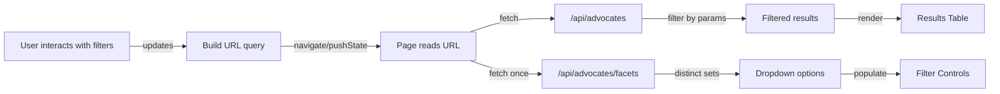

# PRD: Search UI with Backend Filtering via URL Queries

## 1. Summary

- Replace the current single free‑text input with a structured search UI that includes dropdowns and ranges for key fields.
- Move filtering to the backend. The UI constructs URL query parameters, navigates to that URL, and fetches results from the server.
- Dropdown options are populated dynamically from the current dataset (unique cities, degrees, specialties).
- Years of Experience is expressed as predefined ranges: 0-2, 3-5, 6-10, 10+.
- The URL is the single source of truth for search state; initializing and navigating is driven by the URL.

References to current implementation:

- Current client-side free-text search bar: [src/app/components/SearchBar.tsx](src/app/components/SearchBar.tsx)
- Client-side filter logic: [matchesSearch()](src/lib/search.ts:6)
- Page wiring and fetching: [src/app/page.tsx](src/app/page.tsx)
- API endpoint returning data (no filtering yet): [GET()](src/app/api/advocates/route.ts:5)
- Data model: [src/types/advocate.ts](src/types/advocate.ts)

## 2. Problem Statement

The current search UX uses a single text input to match across multiple fields. This is not optimal for discrete at tributes like city, degree, specialties, or years of experience. Users must guess keywords and formatting, and results may be imprecise.

## 3. Goals

- Introduce structured search controls (dropdowns/ranges) for well-defined fields:
  - City (multi-select)
  - Degree (multi-select)
  - Specialties (multi-select)
  - Years of Experience (range buckets: 0-2, 3-5, 6-10, 10+; single-select)
  - Keep a free-text keyword search for name and other fuzzy matches
- Drive search state from the URL query string; changes in the UI update the URL; loading a URL initializes the UI.
- Perform filtering on the server based on URL query parameters, returning only matching records.
- Populate dropdown options dynamically from current data (unique values).
- Support Reset to clear all filters and return to base list.

## 4. Non-Goals

- No advanced relevance ranking beyond basic filtering.
- No authentication/authorization changes.
- No changes to the underlying database schema.
- No sorting/pagination in initial scope (optional future enhancement).

## 5. Users and Key Use Cases

- Coordinator wants to find advocates:
  - By specific city and degree
  - With at least 6 years of experience
  - With at least one of several specialties
  - By name using keyword search

## 6. UX Requirements

Controls:

- Free-text keyword input: searches across name (first/last) and other text-like fields for convenience.
- City dropdown (multi-select) populated from dataset unique values.
- Degree dropdown (multi-select) populated from dataset unique values.
- Specialties multi-select populated from dataset unique values.
- Years of Experience range selector (single-select): values are [0-2], [3-5], [6-10], [10+].
- Reset action: clears all controls to default and updates the URL.
- Loading indicator while fetching.
- Empty-state messaging when no results match.

Behavior:

- Selecting/changing any control updates the URL query parameters.
- URL change triggers a fetch to the backend endpoint with the same query parameters.
- UI initializes control state from the URL on first load.
- All controls remain accessible and responsive on mobile.

Accessibility:

- Controls labeled appropriately with aria-label and associated labels.
- Keyboard operability for all controls and reset.
- High-contrast focus states and proper role semantics.

Responsiveness:

- Controls stack on small screens, align inline on large screens.
- Avoid overflowing tags; collapse with horizontal scrolling or stacked chips if needed.

## 7. URL and State Management

URL is the source of truth. UI reads from and writes to search params.

Query schema:

- q: optional string (keyword)
- city: multi-value (repeatable), e.g., city=Boston&city=Austin
- degree: multi-value (repeatable)
- specialties: multi-value (repeatable)
- yoeRange: one of 0-2, 3-5, 6-10, 10-plus (use 10-plus token for 10+)

Examples:

- /?city=Boston&degree=RN&yoeRange=6-10
- /?q=lee&specialties=ICU&specialties=Dialysis&yoeRange=10-plus
- /?city=Boston&city=Austin&degree=BSN

Encoding rules:

- For multi-select fields, repeat the param name for each selected value.
- Values are case-sensitive for matching against dataset values; normalization rules are applied on the server.
- yoeRange token mapping: 0-2 => [0,2], 3-5 => [3,5], 6-10 => [6,10], 10-plus => [10, Infinity).

## 8. API Design

Endpoints:

1. GET /api/advocates

- Filters records based on query params described above.
- Parameters (all optional):
  - q: string
  - city: string[] (repeatable)
  - degree: string[] (repeatable)
  - specialties: string[] (repeatable)
  - yoeRange: string (0-2|3-5|6-10|10-plus)
- Response: { data: Advocate[] }

2. GET /api/advocates/facets

- Returns dynamic lists for dropdown options computed from the full dataset (not filtered by current query to avoid disappearing options).
- Response:
  {
  cities: string[],
  degrees: string[],
  specialties: string[]
  }

Notes:

- In the current codebase, [GET()](src/app/api/advocates/route.ts:5) returns seeded data only. We will extend the GET handler to parse query params and filter. We will add a new route file for /api/advocates/facets to compute distinct values once per request from the seed or DB.

## 9. Backend Filtering Logic

Shared helpers:

- Reuse [matchesSearch()](src/lib/search.ts:6) for keyword q filtering across fields, with minor adjustments to ensure server-safe usage (trim/lowercase).

Filter application order (AND semantics across categories):

- Start with complete dataset.
- If q present: include records where matchesSearch returns true.
- If city params present: include records where advocate.city is in city[] (case-insensitive match).
- If degree params present: include records where advocate.degree is in degree[] (case-insensitive).
- If specialties present: include records where advocate.specialties intersects specialties[] (at least one selected specialty matches).
- If yoeRange present: include records where advocate.yearsOfExperience falls within mapped min/max bounds, inclusive for both ends and open-ended for 10-plus.

Years of Experience mapping:

- "0-2": min=0, max=2
- "3-5": min=3, max=5
- "6-10": min=6, max=10
- "10-plus": min=10, max=Infinity

Case normalization rules:

- Normalize both the dataset value and query value to lowercase when comparing, but preserve original casing in responses.

## 10. Data Model Impacts

- No schema changes to [src/types/advocate.ts](src/types/advocate.ts).
- Consider adding an enum or constants for known degrees/specialties in the future for consistency, but not required now.

## 11. Frontend Architecture

Components:

- Replace [src/app/components/SearchBar.tsx](src/app/components/SearchBar.tsx) with a new SearchFilters component:
  - Props: current filter state (derived from URL), options (from facets endpoint), change handlers that update URL.
  - Controls: keyword input, multi-select dropdowns for city/degree/specialties, single-select for yoeRange, reset button.
- Page [src/app/page.tsx](src/app/page.tsx) responsibilities:
  - On mount: parse URL, fetch /api/advocates/facets (for options) and /api/advocates with same query (for results).
  - On filter change: update URL (using shallow routing), trigger fetch to /api/advocates with updated params, render results.
  - Keep local state for loading and data; do not store authoritative filter state outside URL.

State source of truth:

- URL query only. No hidden duplicated state. Controls derive values from URL on render.

## 12. Error Handling and Empty States

- If fetching advocates fails: show a non-blocking error banner and leave previous results on screen if available.
- If facets request fails: fall back to computing options on the client from the current dataset (as a graceful degradation), and show a warning banner.
- When no results match: show an empty state message and a quick action to "Reset filters".

## 13. Performance Considerations

- Debounce URL updates from keyword input by 300 ms to avoid excessive requests.
- For dropdowns, update immediately on selection (no debounce).
- API should return only filtered results to minimize payload.
- Cache facets result in memory on server if needed (optional, small dataset).

## 14. Analytics (Optional, if applicable)

- Track filter usage: which fields are used, frequency of yoeRange selections, etc.
- Track result counts to understand effectiveness of filters.

## 15. Risks and Mitigations

- Risk: Multi-select query arrays may be encoded inconsistently.
  - Mitigation: Use repeatable params consistently and robust array parsing on server.
- Risk: 10+ mapping ambiguity.
  - Mitigation: Standardize to token "10-plus" and map to min=10, max=Infinity.
- Risk: Dynamic options shift if computed from filtered results.
  - Mitigation: Facets endpoint computes from full dataset, independent of current query.

## 16. Alternatives Considered

- Client-side only filtering with URL state: simple but fetches entire dataset and moves compute to client; not chosen per requirements.
- Hybrid: coarse filters server-side, specialties free-text client-side; adds complexity without clear benefit for current scope.

## 17. Rollout Plan

1. Backend

- Extend /api/advocates GET to parse query params and return filtered results.
- Add /api/advocates/facets GET to return distinct option sets.

2. Frontend

- Implement SearchFilters component with required controls and URL integration.
- Update page to initialize from URL, fetch facets and filtered results, and react to URL changes.
- Remove direct use of client-only [matchesSearch()](src/lib/search.ts:6) in the rendering path; keep it for server keyword filtering.

3. QA

- Test each control updates URL correctly and returns expected results.
- Test edge cases (no filters, only keyword, multiple selected values, each yoeRange).
- Accessibility checks for controls and keyboard navigation.

## 18. Acceptance Criteria

- Given no query params, the page loads all advocates and shows controls with no selections.
- Given a URL with city=A&city=B, the page shows advocates only in city A or B.
- Given degree=RN and specialties=ICU, results contain at least one specialty ICU and degree RN.
- Given yoeRange=6-10, results have 6-10 inclusive years of experience.
- Given q=lee, results include records whose fields match keyword per [matchesSearch()](src/lib/search.ts:6).
- Reset clears all query params and shows all records.
- Dropdown options are populated from /api/advocates/facets and reflect unique values in the dataset.

## 19. Open Questions

- Should specialties matching be "any selected" (OR) or "all selected" (AND)? Default in this PRD: OR.
- Should degrees and cities allow free-text typeahead or confined to option lists only? Default: confined to options; typeahead display OK.
- Do we need sorting or pagination in near term? Out of scope initially.

## 20. System Flow (Mermaid)

## 21. Implementation Notes (File-Level)

- Server:

  - Modify: [src/app/api/advocates/route.ts](src/app/api/advocates/route.ts)
    - Parse search params, map yoeRange, implement filter logic with AND across categories, OR within multi-select values.
    - Reuse [matchesSearch()](src/lib/search.ts:6) for keyword q.
  - Add: src/app/api/advocates/facets/route.ts
    - Compute and return unique lists for city, degree, specialties from full dataset.

- Client:
  - Add: SearchFilters component (new file) to replace [src/app/components/SearchBar.tsx](src/app/components/SearchBar.tsx)
    - Props: values from URL, options from facets, onChange handlers that update the URL.
    - Controls: keyword input (debounced 300 ms), multi-select dropdowns for city/degree/specialties, single-select for yoeRange, reset button.
  - Update: [src/app/page.tsx](src/app/page.tsx)
    - Read URL on mount and when it changes.
    - Fetch /api/advocates/facets once; fetch /api/advocates whenever URL changes.
    - Remove client-side filtering pipeline in favor of server responses.
